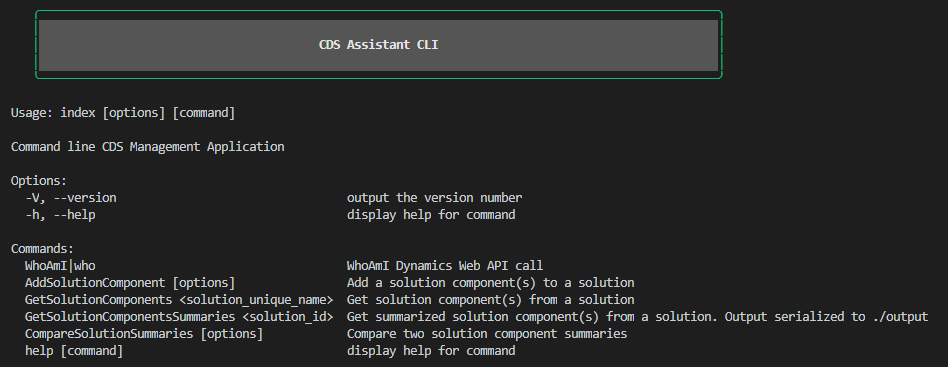

# SolutionComponentManager



## How to use (Important!)

Update the .vscode/launch.json configuration args to test various commands with debugging enabled.

Add the file `src\RunSettings.development.ts` (This file is ignored, DO NOT commit it to the repo), which is templated in `tests\RunSettings.development.template.ts`. Copy the file to the specified location, then modify the values for your environment. The tool currently does not support adding credentials at runtime.

Make sure to update the import paths to the following
```TypeScript
import { IAuthParams, GrantType } from './Authentication/AuthParams'
import { IEnvironmentDetails } from './Authentication/EnvironmentDetails'
 ```

### Examples
To run directly build the project and execute from node in terminal.

``` bash
npm i
npm run build
node dist/index <argument>
```

Get solution summary example:

```bash
node dist/index GetSolutionComponentsSummaries b0367b29-ed8a-ea11-a812-000d3a579ca6
```

Output:
```
[2020-4-22 16:26:37] | INFO: Retrieving components for solution with ID: b0367b29-ed8a-ea11-a812-000d3a579ca6
[2020-4-22 16:26:38] | INFO: Success - Data written to file: ./output/solComponentSummaries_b0367b29-ed8a-ea11-a812-000d3a579ca6_2020422_162638.json
```

Compare two solution summaries example:
```bash
node dist/index CompareSolutionSummaries --solutionPath "./output/solComponentSummaries_65f50035-1568-4fe3-8c91-23029097202d_2021019_232642.json"  --solutionPath2 "./output/solComponentSummaries_496c3d5b-7b5a-eb11-a812-000d3a8c9261_2021019_232456.json"
```

Output:
```
[2021-0-19 23:27:15] | INFO: Comparing solution ./output/solComponentSummaries_65f50035-1568-4fe3-8c91-23029097202d_2021019_232642.json to solution ./output/solComponentSummaries_496c3d5b-7b5a-eb11-a812-000d3a8c9261_2021019_232456.json
[2021-0-19 23:27:15] | INFO: Comparison Result: false
```

## Live build / debug

Use `npm run build:watch` to track file changes and run the debugger in VS Code.

## Contributing

DO NOT MODIFY THE MASTER BRANCH. 

Please create a separate branch and create pull requests to merge changes.
